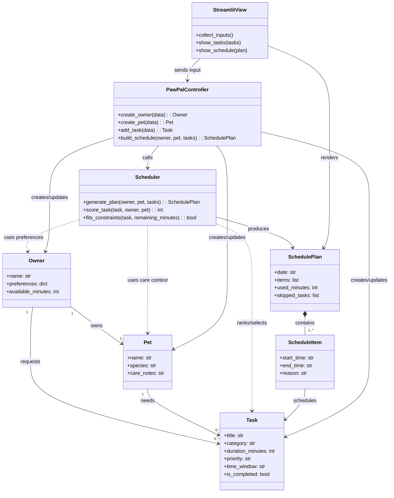

# PawPal+ Project Reflection

## 1. System Design

**a. Initial design**

- Briefly describe your initial UML design.

Answer: My initial UML design followed a simple model-service-UI structure so I could map directly from requirements to implementation. The goal was to keep data entities clean, isolate scheduling logic, and make the Streamlit page act as a thin interaction layer.

I split responsibilities across these core classes:

1. `Owner`
- Stores owner profile and planning preferences (for example available time and preferred task types).

2. `Pet`
- Stores pet identity and care-related context (name, species, notes).

3. `Task`
- Represents one care activity with fields like title/type, duration, priority, optional time window, and completion state.

4. `ScheduleItem`
- Represents a scheduled result (task + start/end time + explanation for why it was selected).

5. `SchedulePlan`
- Holds the final daily plan as an ordered list of `ScheduleItem` objects and summary metadata (used time, skipped tasks).

6. `Scheduler`
- Core decision engine. Selects and orders tasks using constraints (time budget, priority, preferences, and optional time windows).

7. `PawPalController`
- Application coordinator between UI and model/service classes. Receives user inputs, constructs model objects, calls `Scheduler`, and returns a display-ready plan.

8. `StreamlitView` (represented by `app.py`)
- Collects inputs and renders results, while keeping business logic outside the UI layer.

Initial UML (draft):

- What classes did you include, and what responsibilities did you assign to each?

**b. Design changes**

- Did your design change during implementation?
- If yes, describe at least one change and why you made it.

---

## 2. Scheduling Logic and Tradeoffs

**a. Constraints and priorities**

- What constraints does your scheduler consider (for example: time, priority, preferences)?
- How did you decide which constraints mattered most?

**b. Tradeoffs**

- Describe one tradeoff your scheduler makes.
- Why is that tradeoff reasonable for this scenario?

---

## 3. AI Collaboration

**a. How you used AI**

- How did you use AI tools during this project (for example: design brainstorming, debugging, refactoring)?
- What kinds of prompts or questions were most helpful?

**b. Judgment and verification**

- Describe one moment where you did not accept an AI suggestion as-is.
- How did you evaluate or verify what the AI suggested?

---

## 4. Testing and Verification

**a. What you tested**

- What behaviors did you test?
- Why were these tests important?

**b. Confidence**

- How confident are you that your scheduler works correctly?
- What edge cases would you test next if you had more time?

---

## 5. Reflection

**a. What went well**

- What part of this project are you most satisfied with?

**b. What you would improve**

- If you had another iteration, what would you improve or redesign?

**c. Key takeaway**

- What is one important thing you learned about designing systems or working with AI on this project?
