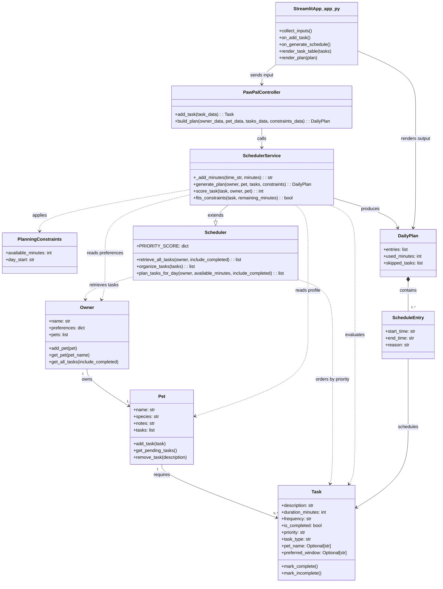
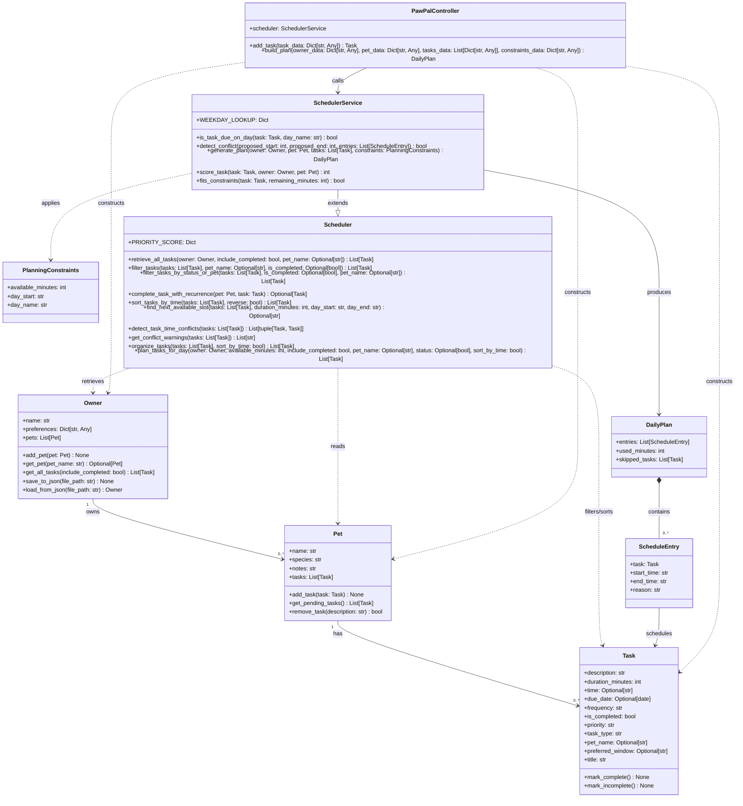

# PawPal+ Project Reflection

## 1. System Design

**a. Initial design**

- Briefly describe your initial UML design.
- What classes did you include, and what responsibilities did you assign to each?

Answer: For this phase, I designed a requirement-first UML that a teacher can quickly map to the assignment rubric: clear data models, one scheduling service, one controller, and a thin Streamlit UI in `app.py`. The design intentionally avoids over-engineering while still supporting constraints, prioritization, and plan explanation.

I used these classes and responsibilities:

1. `Owner`
- Stores owner identity/preferences and manages multiple pets.

2. `Pet`
- Stores pet profile and a list of care tasks.

3. `Task`
- Represents each care activity (description, duration, frequency, completion status, priority, type, linked pet, optional preferred window).

4. `PlanningConstraints`
- Captures daily limits and user choices (available minutes and optional start time).

5. `ScheduleEntry`
- Represents one scheduled task with start/end and a short reason.

6. `DailyPlan`
- Contains ordered schedule entries and summary fields (used minutes, skipped tasks).

7. `SchedulerService`
- Core algorithm unit that filters tasks by constraints, ranks by priority, and builds `DailyPlan`.

8. `Scheduler`
- Shared scheduling "brain" that retrieves and organizes tasks across all of an owner's pets.

9. `PawPalController`
- Orchestrates app flow: validates UI input, builds domain objects, calls scheduler, returns output.

10. `StreamlitApp_app_py`
- The actual UI boundary in `app.py`: collects form inputs, triggers controller actions, displays tasks and plan.

Initial UML (phase-appropriate draft):

**b. Design changes**

- Did your design change during implementation?
- If yes, describe at least one change and why you made it.

Answer: Yes. After reviewing and implementing the skeleton, I made two targeted design changes.

1. Added an explicit Task-to-Pet link
- Change: I added `pet_name: Optional[str]` to `Task`.
- Why: The earlier model had an implied relationship (`Pet` requires tasks), but each task object did not explicitly store which pet it belonged to. This could become a bottleneck if the app later supports multiple pets, because scheduling would not be able to unambiguously assign tasks.

2. Split scheduling responsibility into `Scheduler` + `SchedulerService`
- Change: I introduced a base `Scheduler` class for cross-pet retrieval and organization (`retrieve_all_tasks`, `organize_tasks`, `plan_tasks_for_day`) and kept `SchedulerService` for concrete plan generation (`generate_plan`, `score_task`, `fits_constraints`).
- Why: This reduced logic bottlenecks by separating generic scheduling behavior from app-specific plan building. It also improved maintainability and made the owner-pet-task traversal explicit.

---

## 2. Scheduling Logic and Tradeoffs

**a. Constraints and priorities**

- What constraints does your scheduler consider (for example: time, priority, preferences)?
- How did you decide which constraints mattered most?

Answer: My scheduler considers several practical constraints that reflect real pet-care planning:

1. Time constraints
- `available_minutes` limits the total workload for the day.
- Optional task start times (`HH:MM`) and preferred windows (`HH:MM-HH:MM`) constrain when tasks can fit.

2. Task urgency/importance
- Priority values (`high`, `medium`, `low`) are scored and used during task organization.

3. Recurrence rules
- Daily and weekly tasks are interpreted for day matching and rollover behavior when completed.

4. Completion state and ownership
- Tasks can be filtered by `is_completed` and `pet_name` so plans are focused and relevant.

I prioritized these constraints because they directly affect whether a generated plan is usable in real life: first it must fit available time, then preserve important tasks, then remain understandable and editable by the owner.

**b. Tradeoffs**

- Describe one tradeoff your scheduler makes.
- Why is that tradeoff reasonable for this scenario?

Answer: One tradeoff my scheduler makes is using a lightweight conflict-handling strategy: it detects overlapping task windows and returns warning messages, but it does not automatically re-optimize the entire schedule.

This is reasonable for the PawPal+ scenario because the owner still receives a usable plan quickly, along with clear warnings they can act on. For this project scope, this approach balances correctness, transparency, and maintainability better than adding a complex optimization engine.

---
## Final UML 

## 3. AI Collaboration

**a. How you used AI**

- How did you use AI tools during this project (for example: design brainstorming, debugging, refactoring)?
- What kinds of prompts or questions were most helpful?

Answer: I used AI in four main ways:

1. Design refinement
- I compared my initial UML against the implemented code to keep architecture and documentation aligned.

2. Test strategy
- I generated targeted test plans for both happy paths and edge cases, then converted them into concrete pytest cases.

3. Implementation support
- I used AI to quickly locate where scheduler logic should be integrated into Streamlit display paths (sorting, filtering, conflict warnings).

4. Documentation quality
- I rewrote the README into a professional manual format and aligned features with actual implemented algorithms.

The VS Code Copilot features that were most effective for building my scheduler were:

1. Chat with code context
- I could ask behavior-level questions while Copilot read the actual workspace files, which made sorting/conflict/recurrence decisions much faster to verify.

2. Targeted code edits and patching
- Copilot-generated edits let me update tests, UI wiring, and docs quickly while preserving structure.

3. Fast codebase exploration
- Copilot-assisted searching helped me trace where scheduler methods were implemented and where they should be called from the Streamlit layer.

4. Test-driven iteration support
- Copilot helped generate focused pytest scenarios, then I used quick reruns to tighten edge-case coverage.

The most helpful prompts were specific and behavior-based, for example: "verify daily recurrence rollover," "find edge cases for conflict detection boundaries," and "map UML to current code structure."

Using separate chat sessions for different phases made the project easier to manage. I kept design/UML, implementation, testing, and documentation in distinct threads so each phase had a clear objective and less context noise. That helped me avoid mixing architecture discussion with low-level bug fixing, and it made final write-up cleanup much simpler.

**b. Judgment and verification**

- Describe one moment where you did not accept an AI suggestion as-is.
- How did you evaluate or verify what the AI suggested?

Answer: One moment I did not accept AI output as-is was when a suggested conflict-skipping test assumed a fixed task ordering that did not always hold under the scheduler's tie-break rules. I rejected that assumption because forcing deterministic labels there would have pushed the design toward brittle behavior that was not part of the real requirements.

To keep the system design clean, I modified the test to check the true contract: one task is selected, one is skipped, and both tasks are accounted for. This preserved implementation flexibility while still validating the intended conflict-skip behavior.

I verified this by re-running pytest and confirming the assertions matched scheduler semantics while preserving meaningful coverage.

---

## 4. Testing and Verification

**a. What you tested**

- What behaviors did you test?
- Why were these tests important?

Answer: I tested the core scheduler behaviors most likely to affect user trust:

1. Sorting correctness
- Chronological ordering for HH:MM tasks and consistent placement of untimed tasks.

2. Filtering logic
- Pet-only, status-only, and combined pet+status filters.

3. Recurrence lifecycle
- Daily and weekly rollover, no cloning for non-recurring tasks, and idempotent completion behavior.

4. Conflict detection and warnings
- Same-pet and cross-pet overlaps, boundary cases, and readable non-fatal warning output.

5. Plan generation constraints
- Available-minute budgets, recurrence day matching, preferred-window handling, and skip logic under conflicts.

These tests were important because they verify both algorithm correctness and practical planning behavior seen by end users.

**b. Confidence**

- How confident are you that your scheduler works correctly?
- What edge cases would you test next if you had more time?

Answer: My confidence level is 4/5. The full automated suite passes and covers both happy paths and high-impact edge cases.

If I had more time, I would add:

1. Input robustness tests
- Invalid or malformed time strings and broader input validation around parsing.

2. Stress and scale tests
- Large task sets to evaluate performance and ordering consistency.

3. Property-based checks
- Randomized interval scenarios to strengthen conflict-detection confidence.

4. Integration tests
- End-to-end Streamlit interaction tests for UI-to-scheduler behavior consistency.

---

## 5. Reflection

**a. What went well**

- What part of this project are you most satisfied with?

Answer: I am most satisfied with the end-to-end consistency: the scheduler logic, test suite, README, and UML now all reflect the same system behavior. In particular, the conflict-warning UX and recurrence handling feel practical and clear for real users.

**b. What you would improve**

- If you had another iteration, what would you improve or redesign?

Answer: In another iteration, I would redesign plan generation from a simple greedy selector to a more explicit scoring-and-optimization pipeline. That would make it easier to support richer preferences (for example, pet-specific routines, spacing between tasks, and soft constraints) while keeping explanations transparent.

**c. Key takeaway**

- What is one important thing you learned about designing systems or working with AI on this project?

Answer: Being the lead architect with strong AI tools taught me that my main job is not typing faster, it is making better decisions.

What I learned:

- Architecture is human-owned

AI can generate options quickly, but I must define boundaries, responsibilities, and tradeoffs. The quality of the system still depends on whether I keep a coherent design.

- Precision in prompts creates precision in outcomes

Vague prompts produce generic output. Specific prompts tied to behavior, constraints, and acceptance criteria produce usable design and tests.

- Verification is non-negotiable

I should treat AI suggestions as proposals, not truth. Tests, edge cases, and code review are the control system that keeps quality high.

- “Clean design” means rejecting good-looking but brittle ideas

One of the most important leadership moves is saying no when a suggestion overfits assumptions or adds unnecessary complexity.

- Phase separation improves architectural clarity

Using separate sessions for design, implementation, testing, and documentation helped preserve intent and reduced context drift.

- AI is a force multiplier, not a substitute for judgment

The best workflow is: decide architecture, delegate drafting to AI, validate aggressively, and keep final responsibility for correctness and maintainability.

- Using separate chat sessions by phase (design, implementation, testing, and documentation) also helped me stay organized. It reduced context noise, kept decisions traceable, and made final integration much cleaner.
