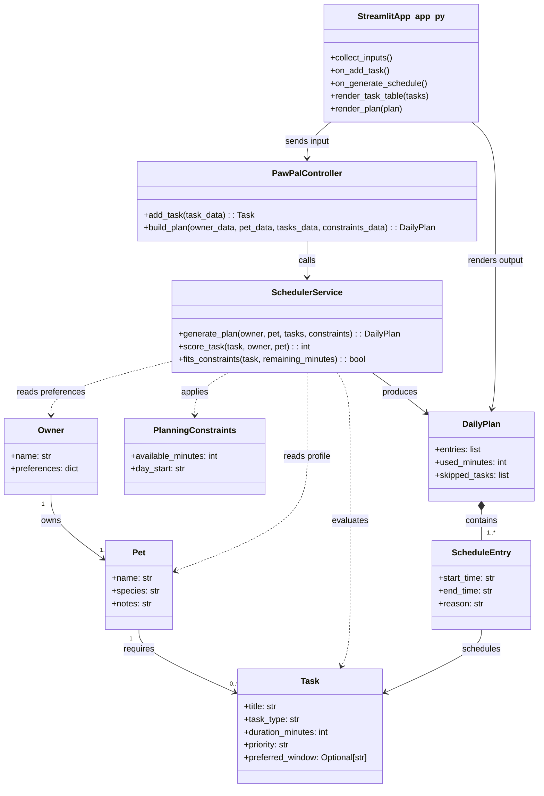

# PawPal+ Project Reflection

## 1. System Design

**a. Initial design**

- Briefly describe your initial UML design.
- What classes did you include, and what responsibilities did you assign to each?

Answer: For this phase, I designed a requirement-first UML that a teacher can quickly map to the assignment rubric: clear data models, one scheduling service, one controller, and a thin Streamlit UI in `app.py`. The design intentionally avoids over-engineering while still supporting constraints, prioritization, and plan explanation.

I used these classes and responsibilities:

1. `Owner`
- Stores owner identity and planning preferences.

2. `Pet`
- Stores pet profile used by scheduling logic.

3. `Task`
- Represents each care activity (title, type, duration, priority, optional preferred window).

4. `PlanningConstraints`
- Captures daily limits and user choices (available minutes and optional start time).

5. `ScheduleEntry`
- Represents one scheduled task with start/end and a short reason.

6. `DailyPlan`
- Contains ordered schedule entries and summary fields (used minutes, skipped tasks).

7. `SchedulerService`
- Core algorithm unit that filters tasks by constraints, ranks by priority, and builds `DailyPlan`.

8. `PawPalController`
- Orchestrates app flow: validates UI input, builds domain objects, calls scheduler, returns output.

9. `StreamlitApp_app_py`
- The actual UI boundary in `app.py`: collects form inputs, triggers controller actions, displays tasks and plan.

Initial UML (phase-appropriate draft):

**b. Design changes**

- Did your design change during implementation?
- If yes, describe at least one change and why you made it.

---

## 2. Scheduling Logic and Tradeoffs

**a. Constraints and priorities**

- What constraints does your scheduler consider (for example: time, priority, preferences)?
- How did you decide which constraints mattered most?

**b. Tradeoffs**

- Describe one tradeoff your scheduler makes.
- Why is that tradeoff reasonable for this scenario?

---

## 3. AI Collaboration

**a. How you used AI**

- How did you use AI tools during this project (for example: design brainstorming, debugging, refactoring)?
- What kinds of prompts or questions were most helpful?

**b. Judgment and verification**

- Describe one moment where you did not accept an AI suggestion as-is.
- How did you evaluate or verify what the AI suggested?

---

## 4. Testing and Verification

**a. What you tested**

- What behaviors did you test?
- Why were these tests important?

**b. Confidence**

- How confident are you that your scheduler works correctly?
- What edge cases would you test next if you had more time?

---

## 5. Reflection

**a. What went well**

- What part of this project are you most satisfied with?

**b. What you would improve**

- If you had another iteration, what would you improve or redesign?

**c. Key takeaway**

- What is one important thing you learned about designing systems or working with AI on this project?
